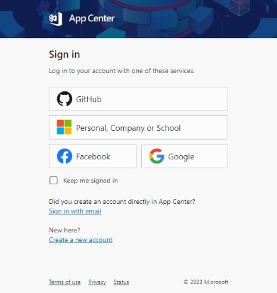
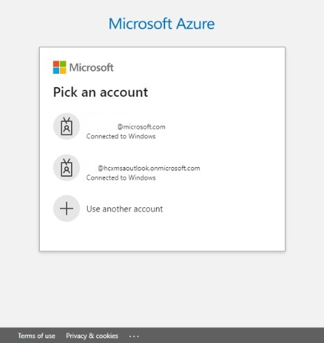

# Seamless AAD SSO for Microsoft Edge Browser

*Are you tired to login multiple times on different websites?
Are you tired to click buttons if you're already signed into your browser?
Are you tired website keep asking you to select an account to signin, even there is only one to choose?*

This is an extension to help AAD users to signin to websites with **N-steps** to **0-step**.

As an information worker, most of corporation controlled resources are to be [AuthNZ] (https://learn.microsoft.com/en-us/azure/active-directory/develop/authentication-vs-authorization) first with your corporation account, normally [AAD (Azure Active Directory)](https://learn.microsoft.com/en-us/azure/active-directory/fundamentals/active-directory-whatis) is widely used.

Luckly, Microsoft Edge browser supports AAD sign-in to profiles, and it brings an SSO experience without requiring the user to sign in to Website again. However, some websites do not adopt the Edge sign-in status well.

This extension leverages Edge AAD sign-in status to seamlessly visit websites like [Loop](https://loop.microsoft.com/), [App Center](https://appcenter.ms), etc.

## Problem Statement

When users visit websites like https://appcenter.ms and try to log in with AAD.

They are always asked to do an account picker regardless of their current Edge AAD sign-in status. This is not very convenient, as it requires an extra account picker step.

## Analysis

When users click on the Personal, Work, or School button `https://appcenter.ms/auth/aad?original_url=%2Fapps`, they are redirected to `https://login.microsoftonline.com/common/oauth2/authorize?redirect_uri=https%3a%2f%2fappcenter.ms%2fauth%2faad%2fcallback&response_type=code+id_token&response_mode=form_post&client_id=<your_client_id>&prompt=select_account&state=<state>&nonce=<nonce>&scope=email+profile+openid&x-client-SKU=passport-azure-ad&x-client-Ver=4.3.2&sso_nonce=<sso_nonce>&client-request-id=<id>&mscrid=<id>`

Because of `prompt=select_account` is added unconditionaly, the authentication server will ask user to do account picker.

## Solution

If the user has signed in with an AAD eligible account (e.g. MSFT AAD account), removing `prompt=select_account` will result in seamless SSO without the account picker.

The following tests have also been conducted:

If the current profile is not logged in or signed in with MSA -> Ask the user to authenticate with a username/password.
If the current profile is signed in with AAD and it is the only profile signed in with AAD -> WebSSO succeeds.
If there are multiple AAD signed profiles, an extra step is required to enable avoiding the AAD account picker.

## Supported applications

* [Loop](https://loop.microsoft.com/)
* [App Center](https://appcenter.ms)

## Credits

* Icon is from https://www.flaticon.com/free-icon/cloud-computing_1474848?term=single+sign+on&page=1&position=37&origin=tag&related_id=1474848.
